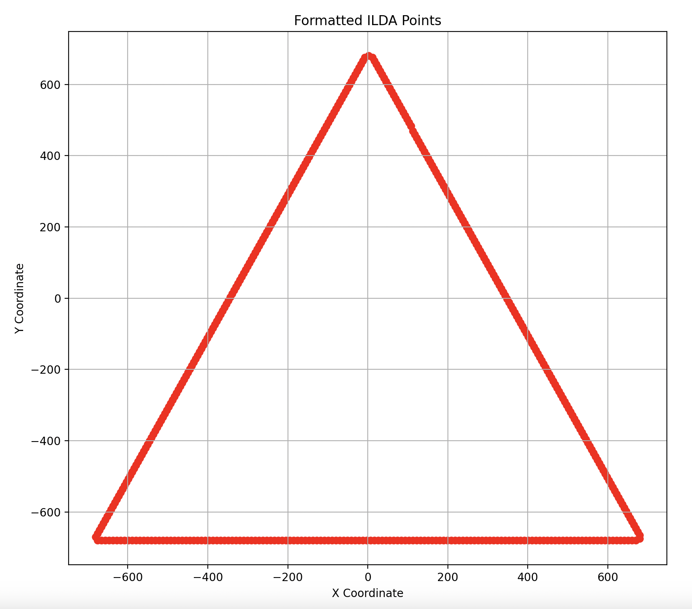
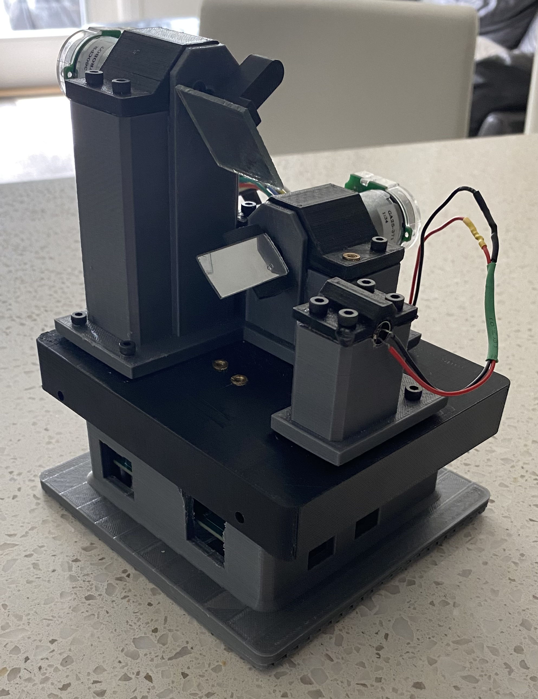
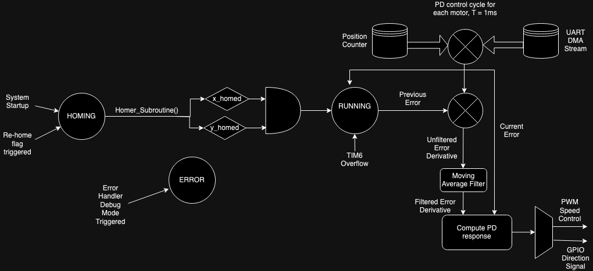
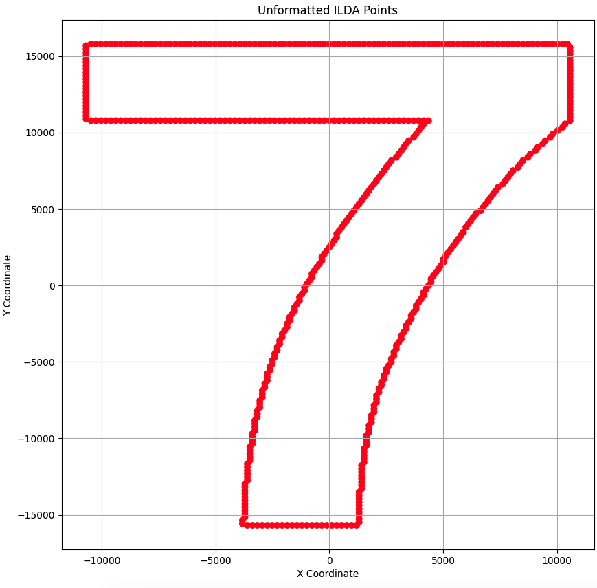
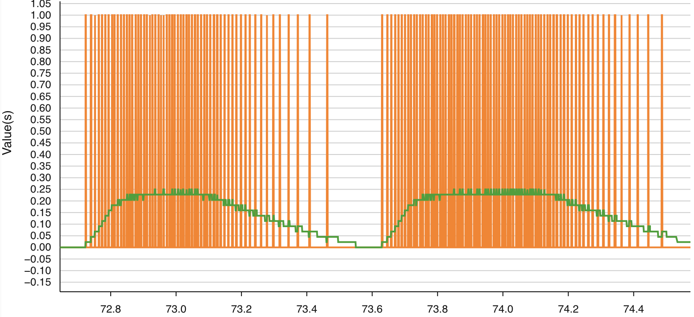
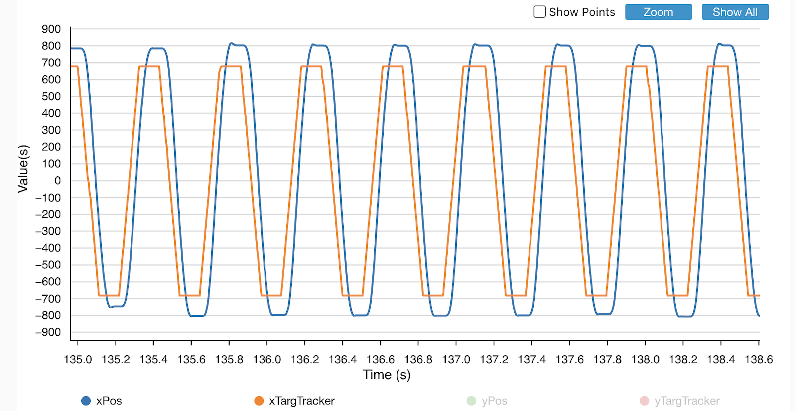
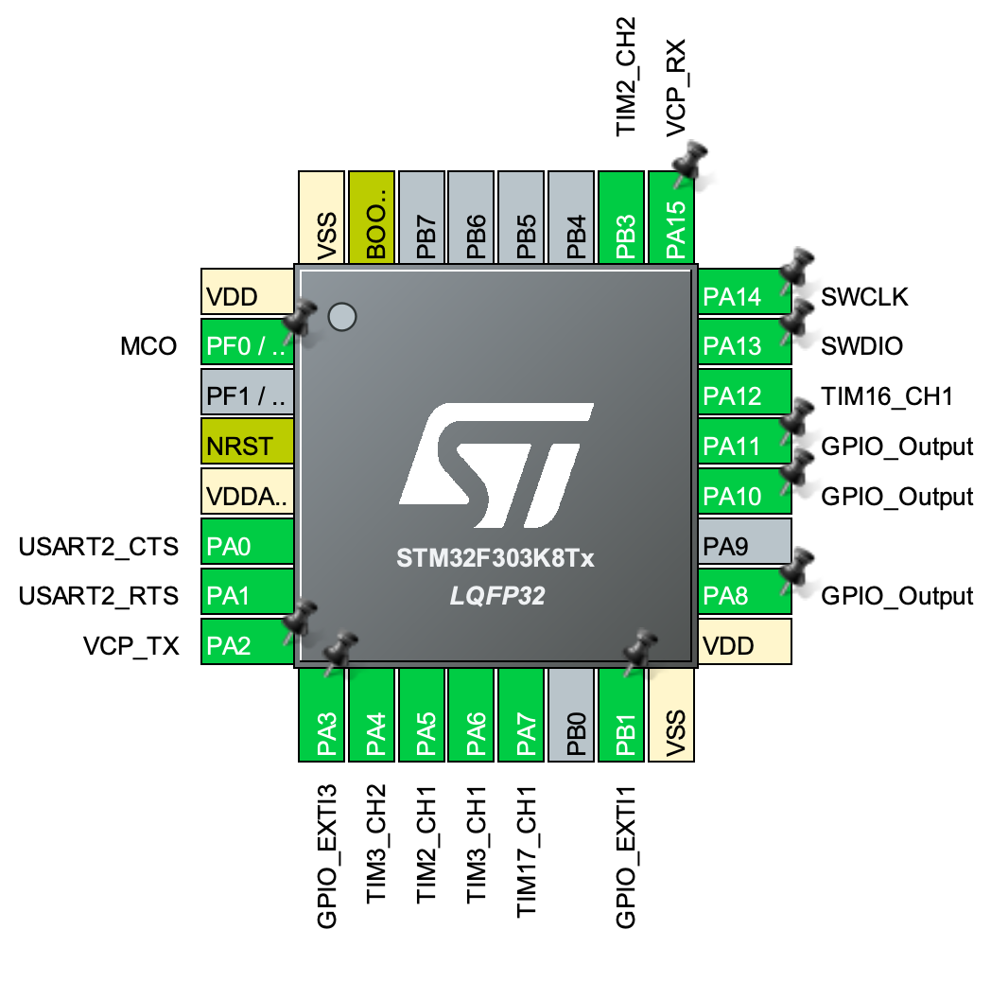
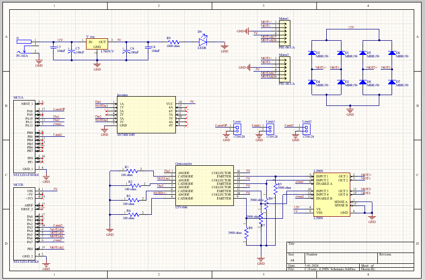
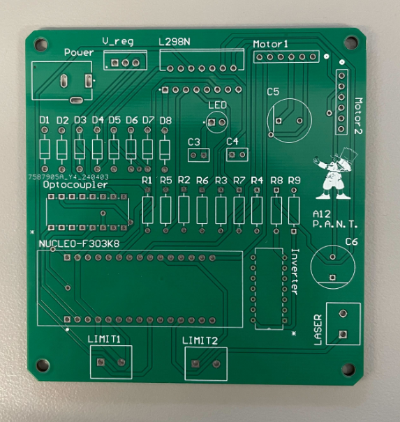
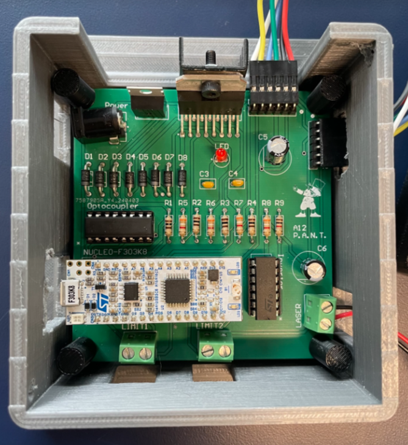

# Bi-Axial Realtime Transcription (BART)

<div style="display: flex; justify-content: space-around; align-items: center;">
   
   
</div>

## Brief
BART is a simple laser projector using two mirrors actuated by a pair of brushed DC motors. This repository contains all source code for BART as well as its sister application, [LISA](https://github.com/ncm88/LISA/) (any Simpsons reference is purely coincidental).




## System Overview
The following state diagram describes the device's operation: <br>


Upon startup, the device is homed via the "homer" subroutine (once again, any Simpsons reference is purely coincidental) after which it awaits further drawing instructions in the `RUNNING` state. The `ERROR` state is activated upon any error raised by any of the HAL functions during execution to aid in debugging purposes.


## Example LISA Call
`python main.py <ilda_path> <port> <baud> <points_per_second> <max_angular_travel>`


## ILDA Image Conversion
[ILDA](https://www.ilda.com/resources/StandardsDocs/ILDA_IDTF14_rev011.pdf) file data is normalized and scaled as follows:

### Step-by-Step Process

#### 1. **Finding Extremes:**
   - Identifies the minimum and maximum values (`minX`, `maxX`, `minY`, `maxY`) for both x and y coordinates among all points, defining the bounding rectangle of all points in the raw data.

#### 2. **Calculating Travel Range:**
   - Computes the travel range (`xTravel` and `yTravel`) as the difference between the maximum and minimum values for both x and y coordinates. The larger of these ranges (`travelScale`) is used to maintain aspect ratio during scaling.

#### 3. **Normalization:**
   - Each point is normalized relative to the total travel range, adjusting coordinates from their original scale to a standard scale where values range from 0 to 1:
     ```plaintext
     xNormalized = (x - minX) / travelScale
     yNormalized = (y - minY) / travelScale
     ```

#### 4. **Scaling to Angular Resolution:**
   - Scales the normalized coordinates up to match the angular resolution of the laser system (`angular_resolution`), converting normalized coordinates into actual angular movements within the hardware's capability:
     ```plaintext
     xCoord = xNormalized * angular_resolution * (xMaxAngleDeg / 180)
     yCoord = yNormalized * angular_resolution * (yMaxAngleDeg / 180)
     ```

#### 5. **Centering:**
   - Adjusts coordinates to center them around the midpoint of the angular range, ensuring movements start from a neutral position and extend equally in all directions:
     ```plaintext
     xCoord = xCoord - (angular_resolution * (xMaxAngleDeg / 360))
     yCoord = yCoord - (angular_resolution * (yMaxAngleDeg / 360))
     ```

#### 6. **Conversion to Absolute Positioning:**
   - Converts signed coordinates to absolute values for compatibility with BART's unsigned position tracking system. The magnitude of converted negative values is dependant on the quadrature encoder's resolution, which in the case of this device is 48960 ticks per motor shaft revolution.


### Example
`python main.py datafiles/letters/7.ild /dev/tty.usbmodem1203 115200 1000 12`

Here we see the points formatted to accomodate a maximum 12-degree offset in the X and Y directions. Note that this is before the signed to unsigned conversion occurs.
<div style="display: flex; justify-content: space-around; align-items: center;">
  
  
</div>


## Image Streaming
### Point Structure
The structure of each streamed point is as follows:

| Byte | Value         | Data Type               |
|------|---------------|-------------------------|
| 1-2  | X-Coordinate  | 16-bit unsigned         |
| 3-4  | Y-Coordinate  | 16-bit unsigned         |
| 5    | Laser Status  | 8-bit unsigned          |
| 6    | Visited Flag  | 8-bit unsigned          |
| 7-8  | Point Number  | 16-bit unsigned         |

The 8-byte point size was chosen both for its ability to effectively contain all relevant point information as well as for alignment with the STM32's 32-bit memory bus.


### Streaming Process
Once LISA has formatted all available ILDA points, they are sent in-order serially over UART through the specified port and at the specified baud rate, the points_per_second parameter here specifies the amount of points per unit time, more specifically it specifies the amount of points per second. 

Streamed points are written directly into a circular buffer via DMA (Direct Memory Access). The circular UART buffer contains the last `UART_BUFFSIZE` points such as to smooth out bursts or delays which may occur during UART transmission. In the `RUNNING` state, the buffer is traversed at a rate of 10kHz (driven by the TIM7 overflow interrupt), during this time, `xTarg`, `yTarg`, and `laser` are set to the respective values contained within the next point struct in which has not been visited. During this assignement, the points `visited` bit is flipped high to mark this point as already visited.

### Considerations
This streaming process is inherently 'soft' real time. This is due to three key factors:
* 1: UART is by definition Asynchronous and as such the MCU can't enforce strict timing on point transmissions. 

* 2: Traversal time across buffer to next available point is variable based on the buffer's current contents as well as the current point position. 

* 3: In order to prevent unforseen priority inversion and ensure hard real-time control performance, the TIM6 controller interrupt takes priority over the TIM7 update point interrupt. 

However, it is important to note that with a simple controller like this, the time to reach a given point is also variable. This arrival time is contingent on the point's distance away from the current position as well as the momentum values present in each motor shaft at reassignment time. As such, it was determined that softer real-time performance in this domain was acceptable due to the mechanical contraints of the system as well as the simplicty and robusteness that this approach provides.


## Position Detection and Speed Control
### Position Detection
Both motors have quadrature encoders mounted to them. `TIM2` and `TIM3` are configured to take two input channels each feeding from their respective motor's encoder. Each timer checks the state of both channels at the primary clock frequency of 8MHz, if channel 1 goes high before channel 2, the timer's `CNT` register value is incremented by one, if the opposite happens it is decremented by one. Each encoder has a resolution of 48960 ticks per revolution meaning each tick corresponds to approximately 0.00735 degrees of travel and we can use 16-bit unsigned integers to capture the full range of motion for each mirror.

### Speed Control
`TIM16` and `TIM17` are used to drive PWM signals in order to control the speed of their respective motors. Both timers tick at the central clock frequency of 8MHz and have a `CNT` buffer size of 8000. The PD controller passes each timer a value from 0 to 7999 in order to set the duty cycle of that timer's active high output channel for that given control cycle. This output channel controls its respective enable pin on the motor driver circuit's H-bridge, thereby controlling how much power the motor receives each control cycle where <br>
`POWER_RATIO = 100/7999 * PD_OUTPUT`.


## PD Controller
### Why PD Was Chosen
PD control was chosen due to the rate at which directions change in the device (up to 1000 times per second). As such, introducing an I-term was shown to add too much phase lag to the controller and had very little use otherwise as at a rate of 1000 points/second there is very little time to rectify stead-state error in the system to begin with.

### PD Control Cycle
The control cycle for each motor consists of the following steps:
* 1: Current error is calculated from the deltas between position registers and the targets. E.g. for the X-axis motor: `xCurrErr = xTarg - TIM2_CNT`

* 2: The change in errors is computed from the previous error and the current error values

* 3: The change in errors is passed through a moving average filter to smooth out the response. A moving average filter is used here due to it's finite impulse response nature resulting in minimal distortion and guaranteed stability.

<br>Below is a test showing the unfiltered error delta signal in orange as well as its filtered counterpart in green:

 <br>
<br>
* 4: A PD output value is computed and mapped to a PWM speed signal (PD output magnitude) and a direction signal (PD output sign)

This control cycle occurs every time the register TIM6_CNT overflows, ensuring a hard real-time control frequency of 1kHz, however timer configurations can be modified such as to allow for control frequencies of up to 10kHz if required.

An example showing the controller in action while drawing a square is provided below:




## Homing
If the system state is set to `HOMING` (as it is during initialization), `homer_subroutine()` is automatically called. This subroutine slowly turns both mirrors until they hit their respective limit switches. When a limit switch is hit, the corresponding interrupt pin is pulled low and an interrupt is triggered which sets either the `x_homed` or `y_homed` values to `true` as well as setting the `CNT` register of that given position counter to the given limit switch's angular offset value. 


## Pinout
BART uses an STM32F303K8 microcontroller, the pinout is as shown below: <br>

| Pin  | Function                                |
|------|-----------------------------------------|
| PA5  | Motor 1 encoder feed channel 1          |
| PB3  | Motor 1 encoder feed channel 2          |
| PA6  | Motor 2 encoder feed channel 1          |
| PA4  | Motor 2 encoder feed channel 2          |
| PA12 | Motor 1 PWM speed signal                |
| PA7  | Motor 2 PWM speed signal                |
| PA10 | Motor 1 direction signal                |
| PA11 | Motor 2 direction signal                |
| PA8  | Laser control signal                    |
| PB1  | Limit Switch 1 interrupt pin            |
| PA3  | Limit Switch 2 interrupt pin            |


## PCB
A four-layer PCB is used in the final version of the system. The PCB schematic is attached below:

<br>

An LN298 H-bridge is used and the microcontroller's outgoing signals to the H-bridge are isolated via optocoupler. This is done to protect the MCU from transients which were observed in testing to be emitting from the H-bridge during changes of direction.


<div style="display: flex; justify-content: space-around; align-items: center;">
  
  
</div>


## Advanced Design considerations
[This Document](https://www.youtube.com/watch?v=dQw4w9WgXcQ) details all design considerations that were too advanced to be included in the .README
